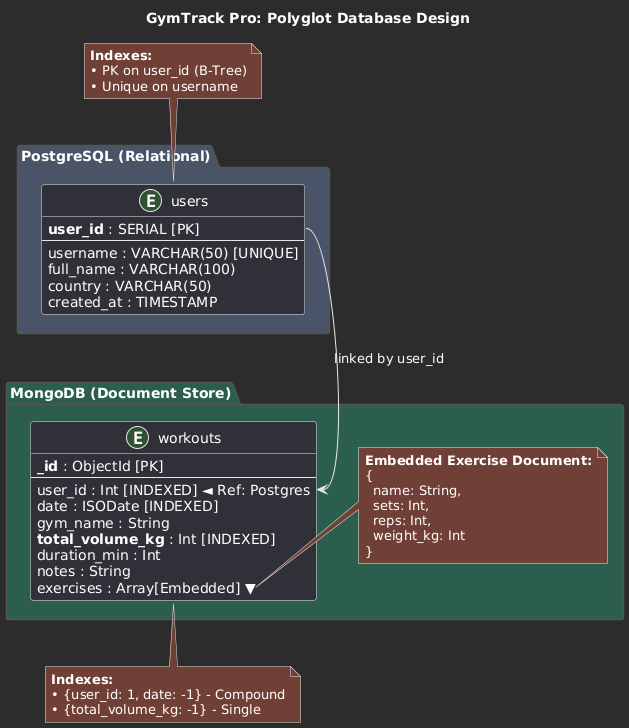
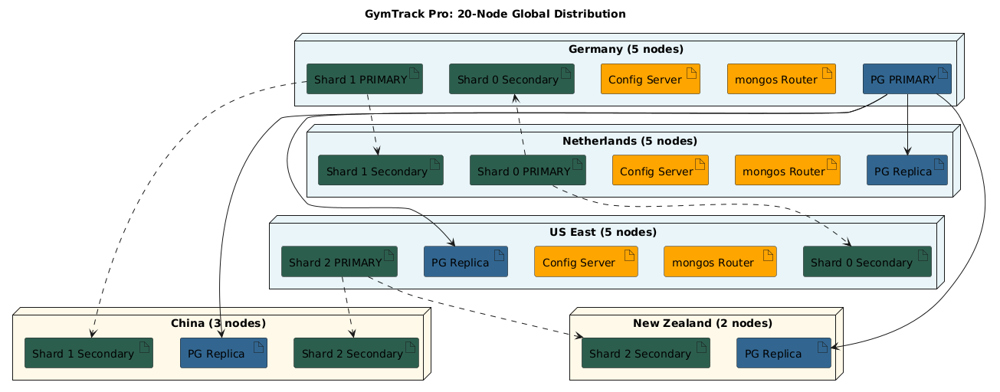

# GymTrack Pro: Documentation

## Table of Contents
1. [Business Domain & Use-Cases](#1-business-domain--use-cases)
2. [Database Design & Polyglot Architecture](#2-database-design--polyglot-architecture)
3. [Complex Operations & Optimization](#3-complex-operations--optimization)
4. [Global Distribution Strategy (20 Nodes)](#4-global-distribution-strategy-20-nodes)
5. [UI Implementation & Reflection](#5-ui-implementation--reflection)

---

## 1. Business Domain & Use-Cases

### Domain Description
GymTrack Pro is a fitness analytics platform focused on the 
Nordic region (Finland, Sweden, Norway, Estonia). Due to growth and international 
interest, the platform has expanded globally to serve users in Europe, Asia-Pacific, 
and the Americas. 

* **Scale:** Designed for thousands of concurrent users during peak hours across 5 continents
* **Traffic Pattern:** Read-heavy (90/10 ratio)
* **Target Audience:** From casual gym-goers to professional powerlifters worldwide
* **Primary Market:** 70% of users remain in the Nordic/European region (FI, SE, NO, EE, NL, DE)

### 10 Typical Use-Cases (Access Patterns)
1.  **[Read]** Authenticate user and fetch profile/location data (PostgreSQL).
2.  **[Write]** Create a new user profile upon registration (PostgreSQL).
3.  **[Write]** Log a workout session with a dynamic list of exercises (MongoDB).
4.  **[Read]** Retrieve the last 10 workout sessions for the dashboard (MongoDB).
5.  **[Read]** View specific exercise details (sets/reps) for a historical session (MongoDB).
6.  **[Read/Complex]** Filter sessions where a specific exercise exceeded a weight limit (Heavy Lift Finder).
7.  **[Read/Complex]** Search for specific gyms or workout notes via keyword (Fuzzy Search).
8.  **[Read/Complex]** Calculate a global leaderboard based on total volume (Aggregation).
9.  **[Read]** Cross-reference MongoDB workout data with PostgreSQL user country for regional rankings.
10. **[Update]** Modify user profile information or session notes.

---

## 2. Database Design & Polyglot Architecture

To handle both structured user data and semi-structured activity logs, a **Polyglot Persistence** architecture was implemented.

### DBMS 1: PostgreSQL (Relational)
Used for high-consistency user management.
* **Table `users`**: Stores `user_id (PK)`, `username`, `full_name`, `country`, and `created_at`.
* **Best Practice:** Ensures no duplicate usernames and maintains a reliable "Source of Truth" for identity.

### DBMS 2: MongoDB (Document-Oriented)
Used for flexible activity logs where exercises vary per session.
* **Collection `workouts`**: Stores rich documents containing nested arrays of exercise objects.
* **Structure:** Includes `user_id` (linking to Postgres), `date`, `gym_name`, `total_volume_kg`, and an `exercises` array.

### Indexing
* **PostgreSQL:** 
    * B-Tree index on `username` for fast logins.
* **MongoDB:** 
    * Index on `user_id` for fast history retrieval.
    * Descending index on `total_volume_kg` to optimize the leaderboard pipeline.

---

## 3. Complex Operations & Optimization

There are three complex operations:

1.  **Aggregation Pipeline:** The leaderboard uses a `$group`, `$sum`, and `$sort` pipeline to process thousands of records into a top-10 list efficiently.
2.  **$elemMatch (Nested Query):** The "Heavy Lift Finder" queries deep into the exercises array to find specific matches within a single object, preventing false positives from multi-exercise sessions.
3.  **Regex Fuzzy Search:** The gym search uses `$regex` with the `i` (case-insensitive) flag to allow users to find gyms with partial keywords.

---

## 4. Global Distribution Strategy (20 Nodes)

To support users across the Netherlands, Germany, China, US East Coast, and New Zealand, a **20-node distributed architecture** was designed and optimized for the Nordic fitness platform's 90/10 read-heavy traffic pattern.

### Data Center Locations
- **Europe (Primary Region):** Netherlands (NL), Germany (DE)
- **Asia:** Xian, China (CN)
- **Americas:** US East Coast (US)
- **Oceania:** New Zealand (NZ)

---

### MongoDB Deployment: 15 Nodes (Sharded Cluster)

**Architecture:** 3 Shards with 3-member Replica Sets + 3 Config Servers + 3 Query Routers

**Sharding Strategy:** Hashed sharding on `user_id`
- **Why Hash?** Ensures even distribution of workout data across shards, preventing hotspots during peak hours
- **Zone Awareness:** Nordic users (FI, SE, NO, EE) are preferentially routed to European shards for GDPR compliance and low latency

#### Shard Distribution (9 Nodes)

**Shard 0 (Europe-focused):**
- Primary: Netherlands
- Secondary: Germany  
- Secondary: US East Coast

**Shard 1 (Global coverage):**
- Primary: Germany
- Secondary: Netherlands
- Secondary: Xian, China

**Shard 2 (Asia-Pacific focused):**
- Primary: US East Coast
- Secondary: Xian, China
- Secondary: New Zealand

**Rationale:** Each shard has one node in Europe (where 70% of users are located), ensuring low-latency reads for the majority. Secondaries in distant regions serve local read queries during off-peak European hours.

#### Config Servers (3 Nodes)
- Netherlands (Primary)
- Germany
- US East Coast

**Purpose:** Store metadata about shard key ranges and cluster configuration. Deployed in a replica set for high availability.

#### mongos Query Routers (3 Nodes)
- Netherlands
- Germany  
- US East Coast

**Purpose:** Route client queries to the appropriate shard. Deployed close to application servers in each major region.

---

### PostgreSQL Deployment: 5 Nodes (Primary-Replica Model)

**Architecture:** 1 Primary + 4 Read Replicas

**Primary (Write Node):**
- Location: Germany
- **Rationale:** Central European location minimizes write latency for 80% of user registrations

**Read Replicas (4 Nodes):**
- Netherlands (serves Nordic/EU users)
- US East Coast (serves American users)
- Xian, China (serves Asian users)  
- New Zealand (serves Oceania users)

**Replication:** Asynchronous streaming replication
- **Why Async?** User profile changes are infrequent (10% write traffic). Slight replication lag (< 1 second) is acceptable for login queries, prioritizing read performance over strict consistency.

**Failover Strategy:** If the German primary fails, the Netherlands replica is promoted (lowest latency for majority users).

---

### Total Node Count: 20 Nodes

| Component | Count | Distribution |
|-----------|-------|--------------|
| MongoDB Shards | 9 | 3 nodes × 3 shards |
| MongoDB Config Servers | 3 | NL, DE, US |
| MongoDB Query Routers | 3 | NL, DE, US |
| PostgreSQL Primary | 1 | DE |
| PostgreSQL Replicas | 4 | NL, US, CN, NZ |
| **TOTAL** | **20** | 5 data centers |

---

### Geographic Node Distribution

| Data Center | MongoDB | PostgreSQL | Total |
|-------------|---------|------------|-------|
| Netherlands (NL) | 4 (Shard nodes + Config + mongos) | 1 (Replica) | **5** |
| Germany (DE) | 4 (Shard nodes + Config + mongos) | 1 (Primary) | **5** |
| US East Coast | 4 (Shard nodes + Config + mongos) | 1 (Replica) | **5** |
| Xian, China (CN) | 2 (Shard nodes) | 1 (Replica) | **3** |
| New Zealand (NZ) | 1 (Shard node) | 1 (Replica) | **2** |
| **TOTAL** | **15** | **5** | **20** |

---

### Optimization for Business Domain

**Nordic User Focus (70% of traffic):**
- All 3 MongoDB shards have at least one node in Europe (NL or DE)
- PostgreSQL primary in Germany ensures fast writes for new registrations
- European mongos routers handle queries without cross-continent routing

**Read-Heavy Pattern (90/10):**
- MongoDB secondaries configured with `readPreference: "nearest"` to serve local reads
- PostgreSQL replicas distribute login queries geographically
- Workout history queries (most common operation) served from local shard secondaries

**Write Optimization:**
- MongoDB writes directed to shard primaries via mongos intelligent routing
- PostgreSQL writes consolidated to German primary, then asynchronously replicated
- Write-after-read consistency guaranteed within same shard via primary reads

**Peak Load Handling (5,000 concurrent users):**
- 9 MongoDB shard nodes + 4 PostgreSQL replicas = 13 read-capable nodes
- Assuming 4,500 peak read requests: ~346 queries/node (well within capacity)
- Config servers and mongos add minimal overhead, primarily routing metadata

---

### Trade-offs & Considerations

**Strengths:**
- Low latency for 80% of users (Nordic region)
- Geographic redundancy prevents single data center failures
- Horizontal scalability through sharding supports future growth

**Weaknesses:**
- Cross-shard transactions not supported (acceptable: workouts are user-scoped)
- Replication lag in distant regions (NZ users may see 1-2 second delays for profile updates)
- Operational complexity managing 20 nodes vs. single-DB deployment

**Why This Design Works for GymTrack Pro:**
The business domain prioritizes read performance for workout history over strict consistency. A user in New Zealand reading their workout log doesn't need real-time synchronization with a profile update happening in Finland. This eventual consistency model allows us to scale globally while maintaining sub-100ms response times for 90% of operations.

---

## 5. UI Implementation & Reflection

### Proof-of-Concept UI
The application is built using Streamlit, which made creating the interactive UI very easy. It provides a real-time interface where users can select their profile, search through workouts using complex filters, log new sessions and delete sessions into the MongoDB backend. 

### Reflection
The most significant challenge in this polyglot setup was application-level joins. Because PostgreSQL and MongoDB are separate systems, the application must act as the orchestrator. For example, the leaderboard requires fetching IDs from MongoDB and then performing a secondary lookup in PostgreSQL to display usernames. 

In a large-scale context, this increases the importance of data consistency. If a user is deleted in the relational DB, a cascade delete logic needs to be implemented in the software to clean up MongoDB. This project highlighted that while NoSQL offers massive scale, the developer takes on the responsibility for referential integrity that a traditional RDBMS would normally handle. Also with larger systems the complexity of the system increases sifnificantly compared to this simple system. 

### AI Disclosure
Artificial intelligence (Gemini 3 Pro) was utilized to assist in the generation of technical diagrams using PlantUML and the refinement of documentation for clarity and tone. Also used for generating the README, which was manually checked and refined.